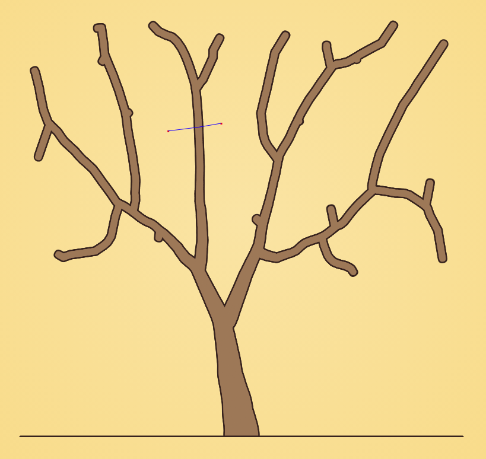

# Tree

A growing tree based on the space colonization algorithm described [here](http://algorithmicbotany.org/papers/colonization.egwnp2007.large.pdf), also implemented by Daniel Shiffman [here](https://www.youtube.com/watch?v=kKT0v3qhIQY).

## Implementation details

### Infinite branching loop

There's a specific situation that arises when attraction points are *almost* exactly diametrically opposed to each other:

             a

    =========x-->

             a

In the diagram above, `=` denotes an existing branch's segments. Attraction points are represented by `a` letters and `x` is the segment being attracted. Also mind that attraction points are not *exactly* opposed to each other, otherwise the resulting vector would be zero.

For the space colonization algorithm to work properly, child branches must become closer to the attraction points than their parents were. This makes the algorithm converge to consuming all attractors and to eventually come to a halt.

In the situation illustrated above, however, the resulting new branch will grow towards a direction that puts it farther apart from both attraction points (designated by an arrow `-->` in the diagram). This culminates with the parent branch being selected again during the next iteration, spawning a new branch from it in the same direction, since the algorithm is deterministic for a given set of attraction points. This happens over and over again, causing the infinite recursion.

To work around this issue, I decided to simply impose a minimum angle between child and parent branches. If the child branch angle doesn't differ too much from parent's direction, do not allow it to spawn. This is what it looks like when the hack is used:

Two attraction points were found in the exact situation that causes the issue and infinite branches would have grown from the branch that crosses them if it wasn't for the hack. Those two points will never be used, but that's fine. We just don't want memory to be filled with thousands of branches and crash the browser tab.
